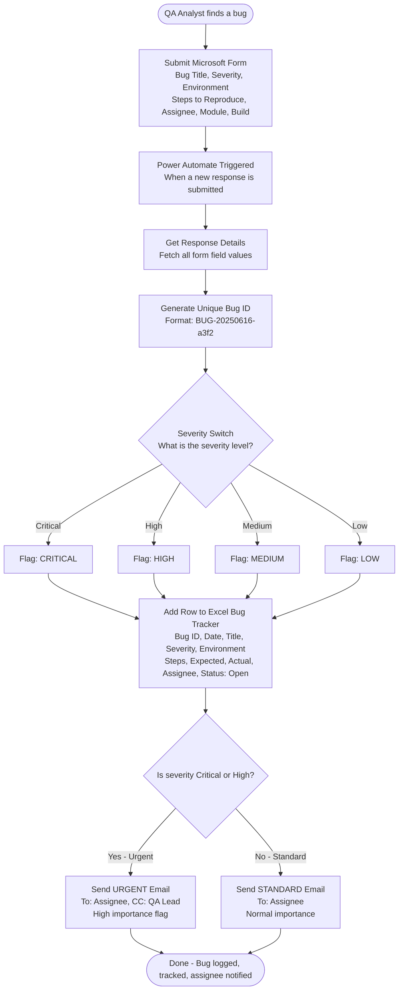

# 🐛 QA Bug Report Automation — Power Automate Flow

> **Automating repetitive QA bug-logging tasks using Microsoft Power Automate**  
> Eliminates 3 manual steps per bug report across Microsoft Forms → Excel → Outlook

---

## 📌 Problem Statement

QA analysts manually repeat the same 3-step process for every bug found:

1. **Log the bug** — fill in JIRA/Excel with title, severity, environment, steps, assignee
2. **Notify the developer** — write and send an email with bug details
3. **Update the tracker** — add a row to the team's shared tracking spreadsheet

On an active sprint with **50+ bugs**, this adds up to hours of repetitive, error-prone manual work. Fields get missed. Notifications get delayed. Tracking falls out of sync.

---

## ✅ Solution

A Power Automate flow that triggers the moment a QA analyst submits a bug report form, then automatically handles all three steps in seconds — with zero manual effort.

---

## 🔄 Flow Diagram



---

## 🧩 Connectors Used

| Connector | Purpose |
|-----------|---------|
| **Microsoft Forms** | Bug report intake form — trigger for the flow |
| **Excel Online (Business)** | Appends bug details to shared tracking spreadsheet |
| **Office 365 Outlook** | Sends HTML-formatted email notification to assignee |

---

## 📋 Microsoft Form Fields

| Field | Type | Description |
|-------|------|-------------|
| Bug Title | Short text | One-line summary of the bug |
| Severity | Choice | Critical / High / Medium / Low |
| Environment | Choice | DEV / SIT / UAT / Production |
| Module / Feature | Short text | Which area of the app is affected |
| Build Version | Short text | App version where bug was found |
| Steps to Reproduce | Long text | Numbered steps to reproduce |
| Expected Result | Long text | What should have happened |
| Actual Result | Long text | What actually happened |
| Reporter Name | Short text | QA analyst's name |
| Assignee Name | Short text | Developer to assign the bug to |
| Assignee Email | Short text | Developer's email for notification |

---

## 📊 Excel Bug Tracker Columns

| Column | Example Value |
|--------|--------------|
| Bug_ID | BUG-20250616-a3f2 |
| Date_Reported | 2025-06-16 09:32 |
| Title | Login button unresponsive on Safari |
| Environment | UAT |
| Severity | High |
| Priority_Flag | 🟠 HIGH |
| Steps_To_Reproduce | 1. Open Safari... |
| Expected_Result | User is redirected to dashboard |
| Actual_Result | Page freezes with no error message |
| Reported_By | Yash Patel |
| Assigned_To | Dev Team Lead |
| Status | Open |
| Module | Authentication |
| Build_Version | v2.4.1 |

---

## 🔀 Flow Logic Summary

```
TRIGGER     → Microsoft Form submitted
STEP 1      → Get full form response details
STEP 2      → Initialize priority variable
STEP 3      → Switch on Severity → set colour-coded priority flag
STEP 4      → Generate unique Bug ID (date + random suffix)
STEP 5      → Add row to Excel tracker (14 columns)
STEP 6      → IF severity = Critical OR High
                  → Send URGENT email (red header, CC QA lead, high importance)
              ELSE
                  → Send STANDARD email (blue header, normal importance)
END         → Bug is logged, tracked, and team is notified
```

---

## 💡 Business Impact

| Metric | Before Automation | After Automation |
|--------|------------------|-----------------|
| Steps per bug report | 3 manual steps | 0 manual steps |
| Time per bug report | ~5 minutes | ~30 seconds (form fill only) |
| Notification delay | Manual — often forgotten | Instant |
| Tracking accuracy | Prone to missing fields | 100% consistent schema |
| Escalation for Critical bugs | Manual CC | Automatic CC to QA lead |
| Sprint with 50 bugs | ~4 hours manual effort | ~25 minutes (form fills only) |

---

## 🛠️ How to Import & Configure

### Prerequisites
- Microsoft 365 account (work or personal)
- Access to Power Automate (make.powerautomate.com)
- OneDrive for the Excel file

### Setup Steps

**1. Create the Microsoft Form**
- Go to forms.microsoft.com
- Create a new form with all fields listed above
- Copy the Form ID from the URL

**2. Create the Excel Tracker**
- Create `BugTracker.xlsx` in OneDrive
- Add a table named `BugTrackerTable` with the 14 columns listed above

**3. Import the Flow**
- Go to make.powerautomate.com → My Flows → Import
- Upload `qa-bug-tracker-flow.json`
- Connect your Microsoft Forms, Excel, and Outlook accounts
- Replace `YOUR_FORM_ID` with your actual Form ID
- Replace `YOUR_EXCEL_FILE_ID` with your actual file ID from OneDrive
- Replace `qa-lead@company.com` with the QA lead's email

**4. Test**
- Submit a test bug report via the Form
- Verify the Excel row appears
- Verify the email arrives with correct formatting

---

## 📁 Repository Structure

```
qa-bug-report-automation/
├── qa-bug-tracker-flow.json     # Power Automate flow definition
└── README.md                    # This file — architecture & setup guide
```

---

## 🏷️ Tags

`Power Automate` `Microsoft Forms` `Excel Online` `Office 365` `QA Automation` `Low-Code` `Process Automation` `Emerging Technologies`

---

*Built to demonstrate low-code automation of repetitive QA workflows — identifying a real manual process pain point and delivering an end-to-end automated solution using the Microsoft Power Platform.*
